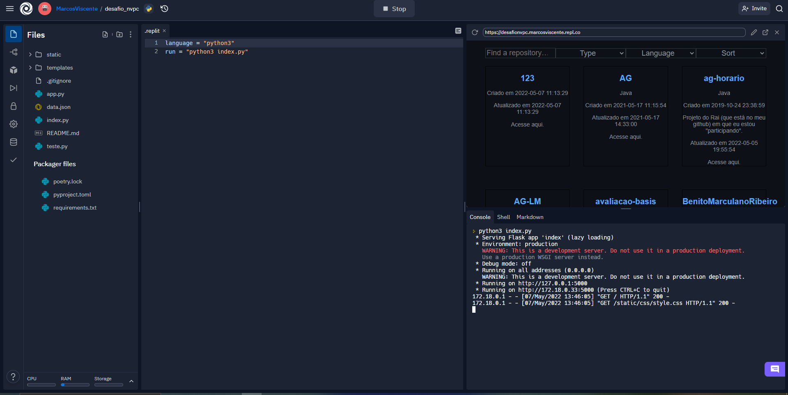

# desafio_nvpc

## Desafio nvpc

Eu quero te desafiar a demonstrar algumas habilidades, desenvolvendo um app simples, que exiba a lista de seus próprios repositórios GITHUB usando a API Graphql pública do GITHUB, ou a API Rest pública do GITHUB.

Essa listagem precisa conter:

1. Funcionalidade de filtro por pelo menos 3 atributos (exemplo, exibir somente repositórios arquivados);
2. Funcionalidade de ordenação alfabética e por data do ultimo commit;
3. Funcionalidade de pesquisa simples (exemplo, pesquiso por "node" e vejo a lista de repositórios que possuem a string "node" em parte do nome.
   Recomendo a publicação desse app no domínio github.io, usando sua conta GITHUB.

Você escolhe que tecnologia irá usar e também é você que decide quanto tempo precisará (só me fale quando vai mostrar a url do app).

## Requisitos

Para esse projeto está sendo usado Python versão 3.8.10 no Windows.

E para a hospedagem usei a plataforma replit (https://replit.com) por ser mais familiarizado com o funcionamento dela.

## Iniciando projeto localmente

```
python -m pip install virtualenv
```

```
python -m virtualenv env
```

```
.\env\Scripts\activate.bat
```

```
pip install -r requirements.txt
```

```
python -m index.py
```

## Iniciando projeto no replit

Crie uma conta no replit.

Crie um novo projeto:


Import do GitHub:


Insira a GitHub url e prossiga:


Aguarde o termino da importação, aparecerá uma tela parecida com essa:


Pressione o botão RUN ou use as teclas Ctrl + Enter:


Aguarde a instalação de todos os pacotes (é automatico), e espere o servidor subir. Aparecerá uma tela semelhante a essa:



Copie o link e pode usar no seu navegador (Chrome, Opera, Firefor, etc):


O resultado será uma tela semelhante e essa:


##### Nota:

O replit pode cair depois de um tempo de inatividade, porém se alguém acessar o site o replit sobe o servidor automaticamente.

## Heroku

O site pode ser acessado no heroku também, [https://desafionvpc.herokuapp.com](https://desafionvpc.herokuapp.com).

## Funcionalidades

As funcionalidades são cumulativas, ou seja, serão exibidos apenas os repositorios que atendam as demandadas de todos os campos.

### Find a repository:

Essa função encontra repositorios que contenha o que estiver escrito no campo, converte o texto digitado e os nomes de repositorios para minusculo para fazer a comparação.

### Types:

Esse campo tem três opções, All, Fork e Archived.

Fork mostra os repositorios que são fork de outros repositorios.

Archived mostra os repositorios que foram arquivados.

All mostra todos os repositorios.

### Language:

Pode ser escolhido uma linguagem a ser exibida.

##### Nota:

A linguaguem do repositorio a ser exibido será a que o github reconhecer, mas o sistema do github não é perfeito, então nem sempre apresenta a linguagem que foi realmente usada.

### Sort:

Neste campo pode ser escolhido a ordenação alfabético por nome de repositorio ou por ulima atualização. o padrão é a ordenação alfabética.

## Considerações finais

A API do github tem limitação de uso, devido a isso decidi criar um arquivo json local para armazenar os dados obtidos em cada requisição, e quando ultrapassar o limite será usado os dados armazenados para manter o projeto funcionando.

O projeto pode e será melhorado com o tempo.
